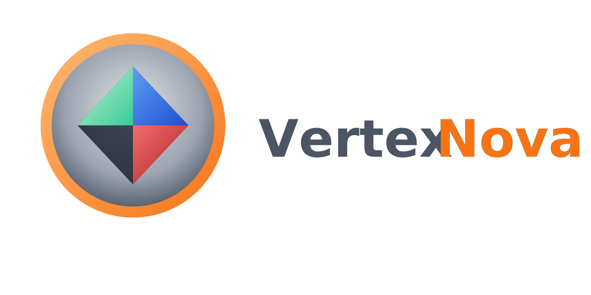

<p align="center">
  
</p>

<p align="center">
  <strong>Camera interaction library (manipulators and controller) for the VertexNova ecosystem</strong>
</p>

<p align="center">
  <a href="https://github.com/vertexnova/vneinteraction/actions/workflows/ci.yml">
    
  </a>
  
  <a href="https://codecov.io/gh/vertexnova/vneinteraction">
    
  </a>
  
</p>

---

## About

VneInteraction provides camera manipulators and a thin input-forwarding controller for the [VertexNova](https://github.com/vertexnova) stack. It does not implement rendering, windowing, or an event system — it consumes raw input (mouse, keyboard, touch) that your application feeds in, and drives cameras from [vnescene](https://github.com/vertexnova/vnescene).

VneInteraction is a C++20 library offering:

- **Manipulators**: Orbit, arcball, FPS, fly, ortho pan/zoom, and follow — each implements `ICameraManipulator` and works with `vne::scene::ICamera` (perspective or orthographic).
- **Factory**: `CameraManipulatorFactory` creates manipulators by type.
- **Controller**: `CameraSystemController` holds the active manipulator and forwards `handleMouseMove`, `handleMouseButton`, `handleMouseScroll`, `handleKeyboard`, `handleTouchPan`, and `handleTouchPinch` from your app.
- **Input-agnostic**: You get input from GLFW, SDL, [vneevents](https://github.com/vertexnova/vneevents), or any source and call the controller’s handle methods; no event-library dependency.

It depends on **vnescene** (and transitively **vnemath**) for cameras and math. Tests use Google Test; examples optionally use **vnelogging**.

## Features

- **Manipulators**: `OrbitManipulator`, `ArcballManipulator`, `FpsManipulator`, `FlyManipulator`, `OrthoPanZoomManipulator`, `FollowManipulator` — viewport, zoom method (dolly / scene scale / FOV), pan, rotation, fit-to-AABB.
- **Factory**: `CameraManipulatorFactory::create(CameraManipulatorType)`.
- **Controller**: `CameraSystemController` — set manipulator, set viewport size, update, and forward mouse/keyboard/touch.
- **Types**: `MouseButton`, `TouchPan`, `TouchPinch`, `ZoomMethod`, `CenterOfInterestSpace`, etc. in `interaction_types.h`.
- **Cross-platform**: Linux, macOS, Windows (and optionally iOS, Android, Web via vnemath).

## Installation

### Option 1: Git Submodule (Recommended)

```bash
git submodule add https://github.com/vertexnova/vneinteraction.git deps/vneinteraction
# Ensure vnescene and vnemath (and optionally vnelogging) are available as dependencies.
```

In your `CMakeLists.txt`:

```cmake
add_subdirectory(deps/vneinteraction)
target_link_libraries(your_target PRIVATE vne::interaction)
```

### Option 2: FetchContent

```cmake
include(FetchContent)
FetchContent_Declare(
    vneinteraction
    GIT_REPOSITORY https://github.com/vertexnova/vneinteraction.git
    GIT_TAG main
)
set(VNE_INTERACTION_EXAMPLES OFF)
FetchContent_MakeAvailable(vneinteraction)
target_link_libraries(your_target PRIVATE vne::interaction)
```

### Option 3: System Install

```bash
git clone --recursive https://github.com/vertexnova/vneinteraction.git
cd vneinteraction
cmake -B build -DCMAKE_BUILD_TYPE=Release -DCMAKE_INSTALL_PREFIX=/usr/local
cmake --build build
sudo cmake --install build
```

In your `CMakeLists.txt` (ensure [vnescene](https://github.com/vertexnova/vnescene) and [vnemath](https://github.com/vertexnova/vnemath) are installed first):

```cmake
list(APPEND CMAKE_MODULE_PATH "${CMAKE_PREFIX_PATH}/lib/cmake/VneInteraction")
find_package(VneInteraction REQUIRED)
target_link_libraries(your_target PRIVATE vne::interaction)
```

Configure with `-DCMAKE_PREFIX_PATH=/usr/local` (or your install prefix) so the Find module is discovered.

## Building

```bash
git clone --recursive https://github.com/vertexnova/vneinteraction.git
cd vneinteraction
cmake -B build -DCMAKE_BUILD_TYPE=Release
cmake --build build
```

For local development (examples + tests enabled):

```bash
cmake -B build -DVNE_INTERACTION_DEV=ON
cmake --build build
```

### CMake Options

| Option | Default | Description |
|--------|---------|-------------|
| `VNE_INTERACTION_TESTS` | `ON` | Build the test suite |
| `VNE_INTERACTION_EXAMPLES` | `OFF` | Build example applications |
| `VNE_INTERACTION_DEV` | `ON` (top-level) | Dev preset: tests and examples ON |
| `VNE_INTERACTION_CI` | `OFF` | CI preset: tests ON, examples OFF |
| `VNE_INTERACTION_LIB_TYPE` | `shared` | Library type: `static` or `shared` |
| `ENABLE_DOXYGEN` | `OFF` | Build API documentation (Doxygen) |
| `ENABLE_COVERAGE` | `OFF` | Enable code coverage reporting |

## Quick Start

```cpp
#include <vertexnova/interaction/interaction.h>
#include <vertexnova/interaction/version.h>
#include <vertexnova/scene/camera/camera.h>
#include <memory>

int main() {
    using namespace vne::interaction;
    using namespace vne::scene;

    const char* ver = get_version();  // e.g. "1.0.0"

    auto camera = CameraFactory::createPerspective(
        PerspectiveCameraParameters(60.0f, 16.0f / 9.0f, 0.1f, 1000.0f));
    camera->setPosition(vne::math::Vec3f(0.0f, 2.0f, 5.0f));

    auto factory = std::make_shared<CameraManipulatorFactory>();
    auto orbit = factory->create(CameraManipulatorType::eOrbit);
    orbit->setCamera(camera);
    orbit->setViewportSize(1280.0f, 720.0f);

    CameraSystemController controller;
    controller.setManipulator(orbit);
    controller.setViewportSize(1280.0f, 720.0f);

    // Each frame: get input from your window/event system, then:
    // controller.handleMouseMove(x, y, delta_x, delta_y, dt);
    // controller.handleMouseButton(button, pressed, x, y, dt);
    // controller.handleMouseScroll(scroll_x, scroll_y, mouse_x, mouse_y, dt);
    // controller.handleKeyboard(key, pressed, dt);
    controller.update(1.0 / 60.0);

    return 0;
}
```

See [examples/01_hello_template](examples/01_hello_template) for a minimal example with version and factory usage.

## Examples

| Example | Description |
|---------|-------------|
| [01_hello_template](examples/01_hello_template) | Minimal usage: version, factory, orbit manipulator, viewport |

Build with `-DVNE_INTERACTION_EXAMPLES=ON` or use the dev preset (`-DVNE_INTERACTION_DEV=ON`). Run from `build/bin/examples/`.

## Documentation

- [API Documentation](docs/README.md) — Generate with Doxygen (`-DENABLE_DOXYGEN=ON`, then `cmake --build build --target vneinteraction_doc_doxygen`).
- [Architecture & design](docs/vertexnova/interaction/interaction.md) — Module overview, components, and usage.

## Platform Support

| Platform | Status | Notes |
|----------|--------|-------|
| Linux | Supported | GCC 10+, Clang 10+ |
| macOS | Supported | Xcode 12+, Apple Clang |
| Windows | Supported | MSVC 2019+, MinGW |
| iOS / visionOS | Supported | Via vnemath/vnescene toolchain |
| Android / Web | Supported | Via vnemath/vnescene |

## Requirements

- C++20
- CMake 3.19+
- [vnescene](https://github.com/vertexnova/vnescene) (required; brings vnemath)
- vnelogging (optional; for examples)
- Google Test (for tests; submodule or FetchContent)

## License

Apache License 2.0 — see [LICENSE](LICENSE) for details.

---

Part of the [VertexNova](https://github.com/vertexnova) project.
