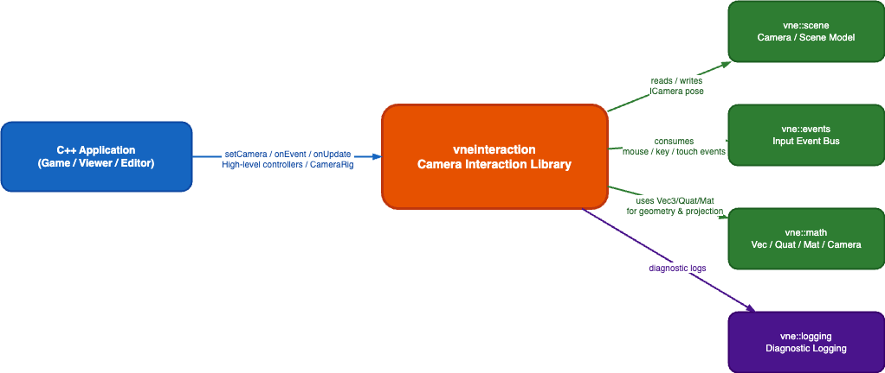
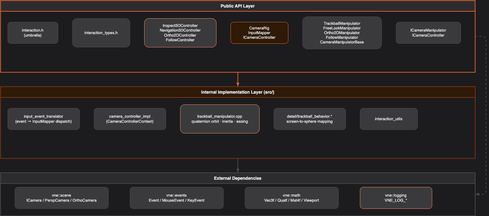

# Vertexnova Interaction

## Overview

The **Vertexnova Interaction** library provides composable camera **manipulators**, **input mapping**, and **high-level controllers** for interactive 3D inspection, FPS-style navigation, 2D orthographic views, and follow cameras. It targets [vnescene](https://github.com/vertexnova/vnescene) cameras and [vneevents](https://github.com/vertexnova/vneevents) input types. It does **not** provide windowing, GL/Vulkan swapchains, or rendering.

**Characteristics:**

- **Event-driven** — Controllers accept `vne::events::Event` via `onEvent(event, delta_time)` and advance simulation-style state with `onUpdate(delta_time)`.
- **Intent layer** — `InputMapper` turns low-level events into semantic `CameraActionType` values and `CameraCommandPayload` data; manipulators consume only what they understand.
- **Composable rigs** — `CameraRig` holds zero or more `ICameraManipulator` instances and forwards every action and update to each (enables hybrid setups, e.g. orbit tooling beside free-look in an editor).
- **Focused math helpers** — Orbit and virtual-trackball geometry live in implementation-side helpers (`OrbitBehavior`, `TrackballBehavior` under `src/vertexnova/interaction/detail/`), composed by `OrbitalCameraManipulator`; they are not registered on the rig as standalone manipulators.



**Figure 1 — System context**

| Element | Description |
|---------|-------------|
| C++ Application | Your game, viewer, or editor: owns the window, feeds events, calls `setCamera` / `onResize` / `onEvent` / `onUpdate`. |
| vneinteraction | This library: controllers, `InputMapper`, `CameraRig`, manipulators. |
| vne::scene | Camera model: `ICamera`, perspective/orthographic types, `CameraFactory`. |
| vne::events | Input events: mouse, keyboard, scroll, touch. |
| vne::math | Vectors, quaternions, matrices (pulled in via scene and public headers). |
| vne::logging | Optional diagnostic logging; the library uses categorized log macros internally. |

If the image above does not load, export `diagrams/context.drawio` to `diagrams/context.png` using Draw.io (same workflow as [vnelogging’s diagram export notes](../../../deps/internal/vnelogging/docs/vertexnova/logging/diagrams/README.md)).

## Architecture

The design is **layered**: application and events sit above controllers; controllers own mapper + rig + manipulators; manipulators write to `ICamera`.

| Layer | Responsibility |
|-------|----------------|
| **Application** | Windowing, event pump, frame loop; calls controller API. |
| **Controller** | `ICameraController` implementations: translate events to mapper calls, wire mapper callbacks to rig, call `onUpdate` on the rig. |
| **Input mapping** | `InputMapper`: rules and presets map hardware events → `CameraActionType` + payload. |
| **Rig** | `CameraRig`: multicast `onAction` / `onUpdate` / lifecycle to all manipulators. |
| **Manipulator** | `ICameraManipulator`: orbit, free-look, ortho 2D, follow — each updates camera pose or parameters. |
| **Scene** | `vne::scene::ICamera`: authoritative camera state for the rest of the engine. |



**Figure 2 — Public API vs implementation (layer view)**

| Swimlane | Contents |
|----------|----------|
| Public API | `interaction.h`, type headers (`interaction_types.h`, `camera_action.h`, `input_binding.h`, `camera_state.h`), controllers, `CameraRig`, `InputMapper`, manipulators, `ICameraManipulator` / `ICameraController`. |
| Implementation | `input_event_translator`, controller context helpers, rotation strategies (`IRotationStrategy`, Euler/trackball), `OrbitBehavior` / `TrackballBehavior`, `camera_math` / `view_math`, and per-class `.cpp` files. |

Export `diagrams/component.drawio` → `diagrams/component.png` when needed.

### Runtime flow (per event / per frame)

Typical flow: **events → controller → `InputMapper` → action callback → `CameraRig::onAction` → each manipulator → camera**. Each frame, **controller → rig → manipulator `onUpdate`** handles inertia, fit-to-AABB animation, and similar continuous behavior.

Multi-page **runtime** diagrams (pipeline, orbit path, FPS path) live in `diagrams/runtime.drawio` (open in [diagrams.net](https://app.diagrams.net)); export tabs to PNG if you want to embed them elsewhere.

### Class-oriented view

A broader UML-style view of types and relationships is in `diagrams/class.drawio` (export to `diagrams/class.png` for embedding).

## Intent model (events → actions)

- **`InputMapper`** — Built from `InputRule` rows (keys, mouse buttons, modifiers, gestures). **Presets** include `orbitPreset`, `fpsPreset`, `gamePreset`, `cadPreset`, and `orthoPreset`.
- **`CameraActionType`** — Semantic commands such as `eBeginRotate`, `eRotateDelta`, `eEndRotate`, pan and zoom actions, free-look deltas, WASD moves, modifiers, reset, pivot-at-cursor, and optional discrete speed keys (declared in `camera_action.h`).
- **`CameraCommandPayload`** — Cursor position, deltas, zoom factor, and button/pressed flags carried with actions.
- **`GestureAction`** — High-level gesture identifiers used with remapping helpers (`bindGesture`, scroll, double-click bindings) without exposing full `InputRule` details to callers.

Manipulators **ignore** actions they do not implement; the rig does not filter per manipulator.

## Key components

### `ICameraManipulator` and `CameraManipulatorBase`

**`ICameraManipulator`** (`camera_manipulator.h`) — Core manipulator contract:

- `onAction`, `onUpdate`, `setCamera`, `onResize`, `resetState`, `isEnabled`, `setEnabled`.

**`CameraManipulatorBase`** (`camera_manipulator_base.h`) — Shared zoom dispatch (`ZoomMethod`: dolly, scene scale, FOV) and common camera/viewport helpers for concrete manipulators.

### Manipulators

#### `OrbitalCameraManipulator`

Orbit around a center of interest: **Euler** or **trackball** rotation (`OrbitRotationMode`), pivot modes (`OrbitPivotMode`), pan, zoom-to-cursor / dolly / FOV, inertia, `fitToAABB`. Delegates rotation math to internal **Euler** / **trackball** strategies and behavior helpers.

#### `FreeLookManipulator`

**FPS** or **Fly** mode: WASD-style motion, mouse look, sprint/slow modifiers; works with perspective or orthographic cameras (ortho uses in-plane pan semantics where applicable).

#### `Ortho2DManipulator`

**Orthographic** cameras only: pan, zoom-at-cursor, optional in-plane rotation, inertia.

#### `FollowManipulator`

Smooth follow of a world target or a callback-provided target; configurable offset and damping.

### Controllers (`ICameraController`)

| Class | Role |
|-------|------|
| `Inspect3DController` | 3D inspection (medical, CAD-style): `OrbitalCameraManipulator` + `InputMapper` (orbit preset), pivot and DOF toggles, `fitToAABB`. |
| `Navigation3DController` | World traversal: `FreeLookManipulator` + `InputMapper` (FPS-style preset), mode and binding configuration. |
| `Ortho2DController` | 2D ortho viewports: `Ortho2DManipulator` + ortho preset. |
| `FollowController` | Follow camera: `FollowManipulator` only; no user input mapping required. |

### Input and rig

#### `InputMapper`

Maps mouse, keyboard, scroll, and touch-style input to **callbacks** invoking `(CameraActionType, CameraCommandPayload, double dt)`. Supports adding rules and replacing the full rule set (used when controllers rebuild bindings after mode or DOF changes).

#### `CameraRig`

- **Lifecycle** — `setCamera`, `onResize`, `resetState`.
- **Dispatch** — `onAction`, `onUpdate` to every registered manipulator.
- **Factories** — `makeOrbit()`, `makeTrackball()`, `makeFps()`, `makeFly()`, `makeOrtho2D()`, `makeFollow()` build rigs with a single default manipulator; you can still `addManipulator` for custom stacks.

### Shared headers and types

| Header | Role |
|--------|------|
| `interaction.h` | Umbrella include for full API surface (manipulators, rig, mapper, controllers, types). |
| `interaction_types.h` | Aggregates behavioral enums and re-exports `camera_action`, `camera_state`, `input_binding`. |
| `camera_action.h` | `CameraActionType`, `CameraCommandPayload`, `GestureAction`. |
| `camera_state.h` | Grouped state structs for orbit, trackball, free-look, etc. |
| `input_binding.h` | `InputRule`, mouse/key bindings, touch helpers, modifier constants. |
| `version.h` | `get_version()` string. |

### Implementation layout (`src/vertexnova/interaction/`)

One **`.cpp` per public class** where applicable, plus `input_mapper.cpp`, `camera_rig.cpp`, `camera_manipulator_base.cpp`, `input_event_translator.cpp`, `camera_math.cpp`, `version.cpp`, and **`detail/`** sources for orbit/trackball behaviors and rotation strategies.

## Usage examples

### Minimal: `Inspect3DController` + perspective camera

```cpp
#include <vertexnova/interaction/interaction.h>
#include <vertexnova/scene/camera/camera.h>
#include <vertexnova/events/mouse_event.h>

int main() {
    using namespace vne::interaction;
    using namespace vne::scene;

    auto camera = CameraFactory::createPerspective(
        PerspectiveCameraParameters(60.0f, 16.0f / 9.0f, 0.1f, 1000.0f));
    camera->setPosition(vne::math::Vec3f(0.0f, 2.0f, 5.0f));
    camera->lookAt(vne::math::Vec3f(0.0f, 0.0f, 0.0f), vne::math::Vec3f(0.0f, 1.0f, 0.0f));

    Inspect3DController ctrl;
    ctrl.setCamera(camera);
    ctrl.onResize(1280.0f, 720.0f);

    // Game loop: feed events then update
    vne::events::MouseMovedEvent move(640.0, 360.0);
    ctrl.onEvent(move, 0.016);
    vne::events::MouseScrolledEvent scroll(0.0, 1.0);
    ctrl.onEvent(scroll, 0.016);
    ctrl.onUpdate(0.016);

    return 0;
}
```

### Bridging from vneevents

Register your platform listener so that each dispatched `vne::events::Event` is forwarded to the active controller’s `onEvent(event, dt)`, and call `onUpdate(dt)` once per frame. Typical event types include `MouseMovedEvent`, `MouseButtonPressedEvent`, `MouseButtonReleasedEvent`, `MouseScrolledEvent`, `KeyPressedEvent`, `KeyReleasedEvent`, and touch variants where enabled.

### Use-case mapping

| Use case | Controller | Notes |
|----------|------------|-------|
| Medical 3D inspection | `Inspect3DController` | Default Euler orbit; `setRotationMode` for trackball; `setPivotMode(eFixed)` for landmark-centred orbits. |
| Medical 2D slices / maps | `Ortho2DController` | Pan and zoom; optional in-plane rotate via `setRotationEnabled(true)`. |
| Game / editor camera | `Navigation3DController` ± `Inspect3DController` | FPS/Fly for worlds; orbit controller for focused inspection. |
| Robotic / scene tools | `Inspect3DController` + `Navigation3DController` + `FollowController` | Inspect assets, walk the scene, follow an end-effector or target. |

## Integration with other VertexNova modules

| Module | How interaction uses it |
|--------|-------------------------|
| **vne::scene** | `ICamera` and concrete camera types; pose and projection writes. |
| **vne::events** | Event types and enums for input. |
| **vne::math** | Linear algebra and utilities (via scene and headers). |
| **vne::logging** | Internal diagnostics; configure logging in the host app if you want sink output from this library (patterns mirror [vnelogging](../../../deps/internal/vnelogging/docs/vertexnova/logging/logging.md)). |

## Build configuration (CMake)

| Option | Default | Description |
|--------|---------|-------------|
| `VNE_INTERACTION_TESTS` | ON | Build unit tests. |
| `VNE_INTERACTION_EXAMPLES` | OFF | Build example programs. |
| `VNE_INTERACTION_DEV` | ON at repo root | Dev preset: tests and examples enabled. |
| `VNE_INTERACTION_CI` | OFF | CI preset: tests ON, examples OFF. |
| `VNE_INTERACTION_LIB_TYPE` | `shared` | `static` or `shared`. |
| `ENABLE_DOXYGEN` | OFF | Generate Doxygen HTML API docs. |

### Static vs shared

- **`static`** (`-DVNE_INTERACTION_LIB_TYPE=static`) — Single binary, no separate interaction DLL/dylib to ship.
- **`shared`** (default) — Suitable for plugins or multiple executables sharing one build; on Windows use `VNE_INTERACTION_API` for correct export/import.

## API documentation (Doxygen)

Enable API docs the same way as in **vnelogging**:

```bash
cmake -DENABLE_DOXYGEN=ON -B build
cmake --build build --target vneinteraction_doc_doxygen
```

HTML output is written under `build/docs/html/` (see `docs/doxyfile.in` `OUTPUT_DIRECTORY`).

## Testing

The repository includes GoogleTest-based tests (manipulators, mappers, rigs, controllers, regression cases). After configuring CMake with tests enabled, build and run the test binary produced for `vneinteraction_tests` (for example from your build tree: `bin/vneinteraction_tests` or via `ctest`).

## Requirements

- **C++20** or higher (as set by this project’s CMake).
- **CMake** 3.19+.
- **Dependencies** — **vnescene**, **vneevents**, and transitive **vnemath** / **vne::logging** / **vne::common** as declared by this repo’s CMake (`deps/internal`).
