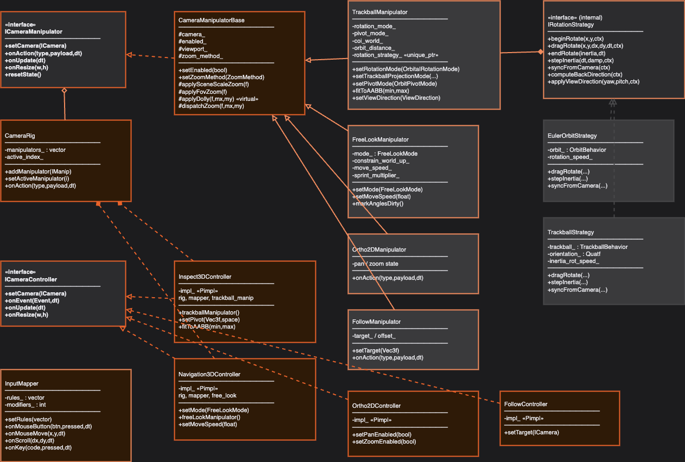
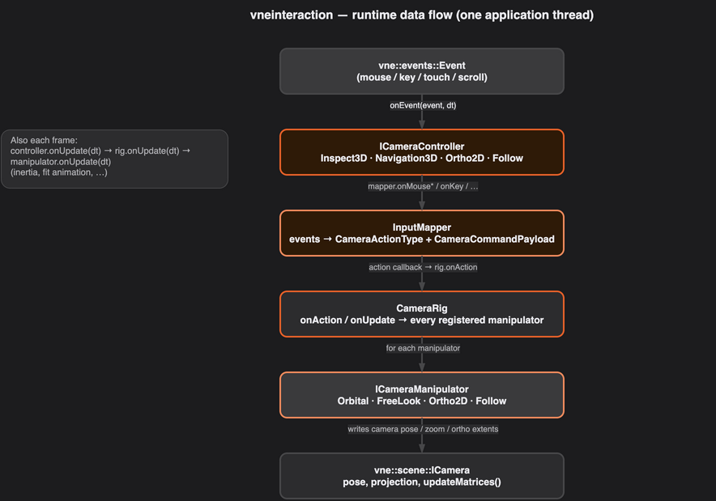

# Vertexnova Interaction

## Overview

The **Vertexnova Interaction** library provides composable camera **manipulators**, **input mapping**, and **high-level controllers** for interactive 3D inspection, FPS-style navigation, 2D orthographic views, and follow cameras. It targets [vnescene](https://github.com/vertexnova/vnescene) cameras and [vneevents](https://github.com/vertexnova/vneevents) input types. It does **not** provide windowing, GL/Vulkan swapchains, or rendering.

**Characteristics:**

- **Event-driven** — Controllers accept `vne::events::Event` via `onEvent(event, delta_time)` and advance simulation-style state with `onUpdate(delta_time)`.
- **Intent layer** — `InputMapper` turns low-level events into semantic `CameraActionType` values and `CameraCommandPayload` data; manipulators consume only what they understand.
- **Composable rigs** — `CameraRig` holds zero or more `ICameraManipulator` instances and forwards every action and update to each (enables hybrid setups, e.g. orbit tooling beside free-look in an editor).
- **Focused math helpers** — `OrbitalCameraManipulator` implements quaternion virtual-trackball orbit in its `.cpp` (internal rotation state + inertia) and uses `TrackballBehavior` in `src/vertexnova/interaction/detail/` for screen-to-sphere mapping; those types are not registered on the rig as standalone manipulators.


**Figure 1 — System context**

| Element | Description |
|---------|-------------|
| C++ Application | Your game, viewer, or editor: owns the window, feeds events, calls `setCamera` / `onResize` / `onEvent` / `onUpdate`. |
| vneinteraction | This library: controllers, `InputMapper`, `CameraRig`, manipulators. |
| vne::scene | Camera model: `ICamera`, perspective/orthographic types, `CameraFactory`. |
| vne::events | Input events: mouse, keyboard, scroll, touch. |
| vne::math | Vectors, quaternions, matrices (pulled in via scene and public headers). |
| vne::logging | Optional diagnostic logging; the library uses categorized log macros internally. |

**Diagram colors** — Draw.io sources in `diagrams/` use the [VertexNova visual style](https://learnvertexnova.com/docs/docs/misc/visual-style/) **primary palette** for slides and diagrams (canvas `#1C1C1E`, panels `#2C2C2E` / `#3A3A3C`, borders `#48484A`, accent orange `#E8622A` on tint `#2E1A07`, secondary stroke `#F28C5E`, text `#EBEBF0` / muted `#AEAEB2`).

If a PNG does not load, export the matching `.drawio` from [diagrams.net](https://app.diagrams.net) (same workflow as [vnelogging’s diagram export notes](https://github.com/vertexnova/vnelogging/blob/main/docs/vertexnova/logging/diagrams/README.md)).



**Figure 2 — Class diagram (major types and relationships)**

| Group | Types |
|-------|--------|
| Interfaces | `ICameraManipulator`, `ICameraController`. |
| Base / rig / mapper | `CameraManipulatorBase`, `CameraRig`, `InputMapper`. |
| Manipulators | `OrbitalCameraManipulator`, `FreeLookManipulator`, `Ortho2DManipulator`, `FollowManipulator`. |
| Controllers | `Inspect3DController`, `Navigation3DController`, `Ortho2DController`, `FollowController`. |
| Orbit internals | Virtual-trackball mapping via `TrackballBehavior` (`detail/`), composed into `OrbitalCameraManipulator` (quaternion orbit + pivot / pan / zoom in the manipulator implementation). |

Export `diagrams/class.drawio` → `diagrams/class.png`.



**Figure 3 — Runtime pipeline (per event and per frame)**

| Stage | Role |
|-------|------|
| Events | `vne::events::Event` delivered into the active controller. |
| Controller | Forwards to `InputMapper`; registers callback → `CameraRig::onAction`. |
| InputMapper | Emits `CameraActionType` + `CameraCommandPayload`. |
| CameraRig | Multicasts `onAction` / `onUpdate` to every manipulator. |
| Manipulators | Update pose, COI, zoom, or ortho extents. |
| Camera | `vne::scene::ICamera` stores the result for rendering and picking. |

The first page of `diagrams/runtime.drawio` (**1. Runtime pipeline**) is the source for this figure; export it to `diagrams/runtime-pipeline.png`. The same file’s other tabs (**2. Orbit rotate**, **3. FPS move + look**) are optional exports for deeper sequence-style views.

## Architecture

The design is **layered**: application and events sit above controllers; controllers own mapper + rig + manipulators; manipulators write to `ICamera`.

| Layer | Responsibility |
|-------|----------------|
| **Application** | Windowing, event pump, frame loop; calls controller API. |
| **Controller** | `ICameraController` implementations: translate events to mapper calls, wire mapper callbacks to rig, call `onUpdate` on the rig. |
| **Input mapping** | `InputMapper`: rules and presets map hardware events → `CameraActionType` + payload. |
| **Rig** | `CameraRig`: multicast `onAction` / `onUpdate` / lifecycle to all manipulators. |
| **Manipulator** | `ICameraManipulator`: orbit, free-look, ortho 2D, follow — each updates camera pose or parameters. |
| **Scene** | `vne::scene::ICamera`: authoritative camera state for the rest of the engine. |


**Figure 4 — Public API vs implementation (layer view)**

| Swimlane | Contents |
|----------|----------|
| Public API | `interaction.h`, `interaction_types.h` (actions, state, bindings, enums), controllers, `CameraRig`, `InputMapper`, manipulators, `ICameraManipulator` / `ICameraController`. |
| Implementation | `input_event_translator`, controller context helpers, `TrackballBehavior` (`detail/trackball_behavior.*`), internal `interaction_utils` (NDC / screen / world cursor math), and per-class `.cpp` files (orbit quaternion + inertia live in `orbital_camera_manipulator.cpp`). |

Export `diagrams/component.drawio` → `diagrams/component.png`.

## Intent model (events → actions)

- **`InputMapper`** — Built from `InputRule` rows (keys, mouse buttons, modifiers, gestures). **Presets** include `orbitPreset`, `fpsPreset`, `gamePreset`, `cadPreset`, and `orthoPreset`.
- **`CameraActionType`** — Semantic commands such as `eBeginRotate`, `eRotateDelta`, `eEndRotate`, pan and zoom actions, free-look deltas, WASD moves, modifiers, reset, pivot-at-cursor, and optional discrete speed keys (defined in `interaction_types.h`).
- **`CameraCommandPayload`** — Cursor position, deltas, zoom factor, and button/pressed flags carried with actions.
- **`GestureAction`** — High-level gesture identifiers used with remapping helpers (`bindGesture`, scroll, double-click bindings) without exposing full `InputRule` details to callers.

Manipulators **ignore** actions they do not implement; the rig does not filter per manipulator.

## Key components

### `ICameraManipulator` and `CameraManipulatorBase`

**`ICameraManipulator`** (`camera_manipulator.h`) — Core manipulator contract:

- `onAction`, `onUpdate`, `setCamera`, `onResize`, `resetState`, `isEnabled`, `setEnabled`.

**`CameraManipulatorBase`** (`camera_manipulator_base.h`) — Shared zoom dispatch (`ZoomMethod`: dolly, scene scale, FOV) and common camera/viewport helpers for concrete manipulators.

### Manipulators

#### `OrbitalCameraManipulator`

Orbit around a center of interest using a **quaternion virtual trackball** (screen mapping via `TrackballBehavior`), plus pivot modes (`OrbitPivotMode`), pan, zoom-to-cursor / dolly / FOV, rotation and pan inertia, optional **time-eased** perspective `fitToAABB` (`setFitAnimationDuration`, use `0` for instant) and **`animateToViewDirection`** for animated view presets (`setViewDirection` stays instant). **`setOrbitAnimationEnabled(false)`** turns off eased fit and view animation together while keeping the stored fit duration. `Inspect3DController` forwards `fitToAABB` and **`setOrbitAnimationEnabled`**; other tuning via **`orbitalCameraManipulator()`**.

#### `FreeLookManipulator`

**FPS** or **Fly** mode: WASD-style motion, mouse look, sprint/slow modifiers; works with perspective or orthographic cameras (ortho uses in-plane pan semantics where applicable).

#### `Ortho2DManipulator`

**Orthographic** cameras only: pan, zoom-at-cursor, optional in-plane rotation, inertia.

#### `FollowManipulator`

Smooth follow of a world target or a callback-provided target; configurable offset and damping.

### Controllers (`ICameraController`)

| Class | Role |
|-------|------|
| `Inspect3DController` | 3D inspection (medical, CAD-style): `OrbitalCameraManipulator` + `InputMapper` (orbit preset), pivot and DOF toggles, `fitToAABB`; **`setOrbitAnimationEnabled`** to disable eased fit / `animateToViewDirection` without changing stored duration; fine-tuning via `orbitalCameraManipulator()`. |
| `Navigation3DController` | World traversal: `FreeLookManipulator` + `InputMapper` (FPS-style preset), mode and binding configuration. |
| `Ortho2DController` | 2D ortho viewports: `Ortho2DManipulator` + ortho preset. |
| `FollowController` | Follow camera: `FollowManipulator` only; no user input mapping required. |

### Input and rig

#### `InputMapper`

Maps mouse, keyboard, scroll, and touch-style input to **callbacks** invoking `(CameraActionType, CameraCommandPayload, double dt)`. Supports adding rules and replacing the full rule set (used when controllers rebuild bindings after mode or DOF changes).

#### `CameraRig`

- **Lifecycle** — `setCamera`, `onResize`, `resetState`.
- **Dispatch** — `onAction`, `onUpdate` to every registered manipulator.
- **Factories** — `makeOrbit()`, `makeTrackball()`, `makeFps()`, `makeFly()`, `makeOrtho2D()`, `makeFollow()` build rigs with a single default manipulator; you can still `addManipulator` for custom stacks.

### Shared headers and types

| Header | Role |
|--------|------|
| `interaction.h` | Umbrella include for full API surface (manipulators, rig, mapper, controllers, types). |
| `interaction_types.h` | Behavioral enums, `CameraActionType` / `CameraCommandPayload` / `GestureAction`, grouped state structs, and `InputRule` / bindings / touch helpers. |
| `version.h` | `get_version()` string. |

### Implementation layout (`src/vertexnova/interaction/`)

One **`.cpp` per public class** where applicable, plus `input_mapper.cpp`, `camera_rig.cpp`, `camera_manipulator_base.cpp`, `input_event_translator.cpp`, `interaction_utils.cpp`, `version.cpp`, and **`detail/trackball_behavior.cpp`** for virtual-trackball screen mapping (used by `OrbitalCameraManipulator`).

## Quick start

Controllers are **event-driven**: create a `vne::scene::ICamera`, attach a controller, call `onResize` once with the drawable size, then each frame forward `vne::events::Event` with `onEvent(event, dt)` and call `onUpdate(dt)` (`dt` in seconds).

The snippet below uses **`Inspect3DController`** (orbit / pan / zoom on a perspective camera). Swap the controller type for other workflows — see the table and [Examples](#examples) below.

```cpp
#include <vertexnova/interaction/interaction.h>
#include <vertexnova/scene/camera/camera.h>

auto camera = vne::scene::CameraFactory::createPerspective(
    vne::scene::PerspectiveCameraParameters(60.0f, 16.0f / 9.0f, 0.1f, 1000.0f));
camera->setPosition(vne::math::Vec3f(4.0f, 3.0f, 6.0f));
camera->lookAt(vne::math::Vec3f(0.0f, 0.0f, 0.0f), vne::math::Vec3f(0.0f, 1.0f, 0.0f));

vne::interaction::Inspect3DController ctrl;
ctrl.setCamera(camera);
ctrl.onResize(1280.0f, 720.0f);

while (!window.shouldClose()) {
    double dt = timer.tick();
    for (auto& event : window.pollEvents())
        ctrl.onEvent(event, dt);
    ctrl.onUpdate(dt);
    renderer.drawFrame(camera);
}
```

### Choosing a controller

| Use case | Recommended controller | Default bindings |
|---|---|---|
| 3D model viewer / CAD / medical | `Inspect3DController` | LMB=orbit, RMB/MMB=pan, scroll=zoom, double-click LMB=set pivot |
| FPS walkthrough / game editor | `Navigation3DController` (eFps) | WASD+mouse look, RMB=look, scroll=zoom, Shift=sprint, Ctrl=slow |
| Flight / space / drone sim | `Navigation3DController` (eFly) | Same as FPS, pitch unconstrained |
| 2D slice / map / diagram | `Ortho2DController` | RMB/MMB=pan, scroll=zoom |
| Cinematic follow / third-person | `FollowController` | No user input; target-driven |
| Hybrid editor (orbit + walk) | `Inspect3DController` + `Navigation3DController` | Hot-key toggle; both share one `ICamera` |
| Custom rig (advanced) | `CameraRig` directly | Compose manipulators; wire your own `InputMapper` |

### Examples

Longer recipes — orbit / pan / zoom, pivot modes, `fitToAABB`, ortho and navigation tuning, `InputMapper` rebinding, hybrid `CameraRig` stacks, camera state save/restore, and headless simulated input — live in the repository **[`examples/`](../../../examples/README.md)**. Build with `-DVNE_INTERACTION_EXAMPLES=ON` or `-DVNE_INTERACTION_DEV=ON` at the repo root; executables are written to `build/bin/examples/`. See **[`examples/README.md`](../../../examples/README.md)** for the numbered topic index (`01_library_info` … `08_camera_state_save_restore`).

**Event coverage** — `Inspect3DController` and `Ortho2DController` need mouse button, move, and scroll events; `Navigation3DController` also needs key pressed/released. `FollowController` is driven by `onUpdate` only. Translate your windowing API into `vne::events::Event`; the examples use helpers under `examples/common/` for headless runs.

## Integration with other VertexNova modules

| Module | How interaction uses it |
|--------|-------------------------|
| **vne::scene** | `ICamera` and concrete camera types; pose and projection writes. |
| **vne::events** | Event types and enums for input. |
| **vne::math** | Linear algebra and utilities (via scene and headers). |
| **vne::logging** | Internal diagnostics; configure logging in the host app if you want sink output from this library (patterns mirror [vnelogging](https://github.com/vertexnova/vnelogging/blob/main/docs/vertexnova/logging/logging.md)). |

## Build configuration (CMake)

| Option | Default | Description |
|--------|---------|-------------|
| `VNE_INTERACTION_TESTS` | ON | Build unit tests. |
| `VNE_INTERACTION_EXAMPLES` | OFF | Build example programs. |
| `VNE_INTERACTION_DEV` | ON at repo root | Dev preset: tests and examples enabled. |
| `VNE_INTERACTION_CI` | OFF | CI preset: tests ON, examples OFF. |
| `VNE_INTERACTION_LIB_TYPE` | `shared` | `static` or `shared`. |
| `ENABLE_DOXYGEN` | OFF | Generate Doxygen HTML API docs. |

### Static vs shared

- **`static`** (`-DVNE_INTERACTION_LIB_TYPE=static`) — Single binary, no separate interaction DLL/dylib to ship.
- **`shared`** (default) — Suitable for plugins or multiple executables sharing one build; on Windows use `VNE_INTERACTION_API` for correct export/import.

## API documentation (Doxygen)

Enable API docs the same way as in **vnelogging**:

```bash
cmake -DENABLE_DOXYGEN=ON -B build
cmake --build build --target vneinteraction_doc_doxygen
```

HTML output is written under `build/docs/html/` (see `docs/doxyfile.in` `OUTPUT_DIRECTORY`).

## Testing

The repository includes GoogleTest-based tests (manipulators, mappers, rigs, controllers, regression cases). After configuring CMake with tests enabled, build and run the test binary produced for `vneinteraction_tests` (for example from your build tree: `bin/vneinteraction_tests` or via `ctest`).

## Requirements

- **C++20** or higher (as set by this project’s CMake).
- **CMake** 3.19+.
- **Dependencies** — **vnescene**, **vneevents**, and transitive **vnemath** / **vne::logging** / **vne::common** as declared by this repo’s CMake (`deps/internal`).
