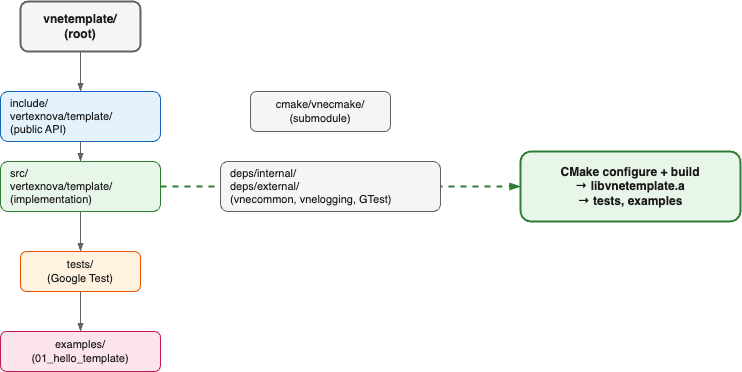

# VertexNova Interaction

## Overview

VneInteraction is a C++ library providing camera manipulators and interaction for the VertexNova ecosystem. It includes orbit, arcball, FPS, fly, orthographic pan/zoom, and follow manipulators, minimal camera interfaces (ICamera, PerspectiveCamera, OrthographicCamera), a factory, and a controller. The library uses vnemath for all math and follows CODING_GUIDELINES.md.


**Figure 1: Context Diagram**

| Element | Description |
|---------|-------------|
| C++ Application | Code that uses the interaction API (tests, examples, or your app) |
| VneInteraction | Interaction library; provides `get_version()`, manipulators, factory, controller, and camera types |

## Project layout and build

The project uses a standard layout and builds one library per build (static or shared), plus tests and optional examples. The library target is `vneinteraction` with alias `vne::interaction`.



**Figure 2: Project layout and build**

| Element | Description |
|---------|-------------|
| include/vertexnova/interaction/ | Public API headers (manipulators, factory, controller, types, version) |
| include/vertexnova/scene/camera/ | Camera interfaces (ICamera, PerspectiveCamera, OrthographicCamera) |
| src/vertexnova/interaction/ | Implementation |
| tests/ | Unit tests (Google Test) |
| examples/ | Example apps (e.g. `01_hello_template`) |
| deps/internal/ | Internal deps (vnemath, vnecommon, vnelogging) |
| CMake configure + build | Produces `libvneinteraction.a` or `libvneinteraction.so` (or `.dylib`/`.dll`), plus tests and examples |

See the root [README.md](../../../README.md) for prerequisites, dependencies, and build commands.

## API usage

The public API lives in namespace `vne::interaction` and includes:

- **Version:** `get_version()` returns the project version string (e.g. `"1.0.0"`).
- **Factory:** `CameraManipulatorFactory::create(CameraManipulatorType)` creates manipulators (eOrbit, eArcball, eFps, eFly, eOrthoPanZoom, eFollow).
- **Controller:** `CameraSystemController` holds the current manipulator and forwards input.
- **Manipulators:** Implement `ICameraManipulator` (setCamera, setViewportSize, handleMouseMove, handleMouseButton, handleMouseScroll, getSceneScale, resetState, fitToAABB, etc.).
- **Cameras:** `ICamera`, `PerspectiveCamera`, `OrthographicCamera` from `vertexnova/scene/camera/`.

Example:

```cpp
#include <vertexnova/interaction/interaction.h>
#include <vertexnova/interaction/version.h>

const char* ver = vne::interaction::get_version();  // e.g. "1.0.0"
auto factory = std::make_shared<vne::interaction::CameraManipulatorFactory>();
auto orbit = factory->create(vne::interaction::CameraManipulatorType::eOrbit);
orbit->setViewportSize(1280.0f, 720.0f);
```

## CMake options

| Option | Default | Description |
|--------|---------|-------------|
| `VNE_INTERACTION_TESTS` | ON | Build unit tests. |
| `VNE_INTERACTION_EXAMPLES` | ON (dev/top-level) / OFF (submodule) | Build examples. |
| `VNE_INTERACTION_LIB_TYPE` | shared | Library type: `static` or `shared`. Target is `vneinteraction` (alias `vne::interaction`). |
| `WARNINGS_AS_ERRORS` | OFF | Treat compiler warnings as errors. |
| `ENABLE_DOXYGEN` | OFF | Generate Doxygen documentation. |

## Static vs shared for deployment

- **Static** (`-DVNE_INTERACTION_LIB_TYPE=static`): Single executable, no runtime lib to ship.
- **Shared** (`-DVNE_INTERACTION_LIB_TYPE=shared`, default): For plugins or many apps sharing one lib. On Windows, use `VNE_INTERACTION_API` for DLL export/import.

## Documentation

- **This document:** `docs/vertexnova/template/template.md`
- **Diagrams:** `docs/vertexnova/template/diagrams/` (Draw.io sources; see [diagrams/README.md](diagrams/README.md))
- **API reference:** Generated by Doxygen when `-DENABLE_DOXYGEN=ON` (see root README)
